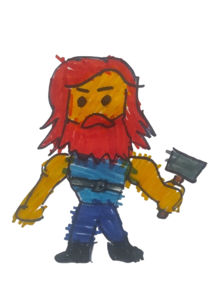
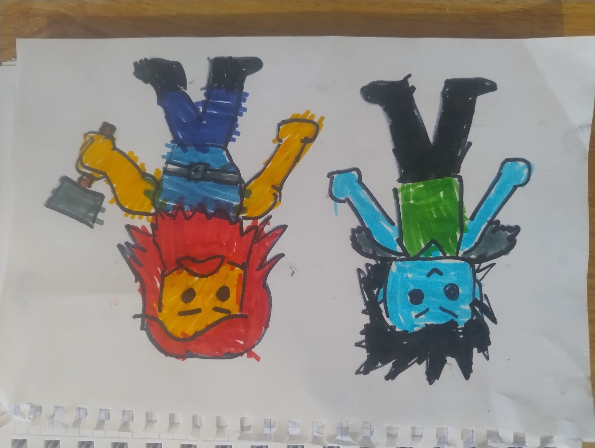
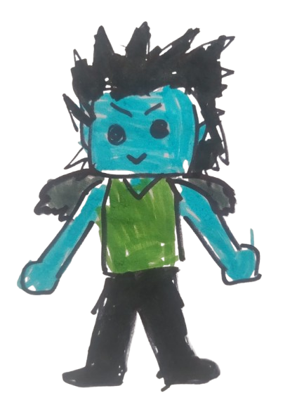
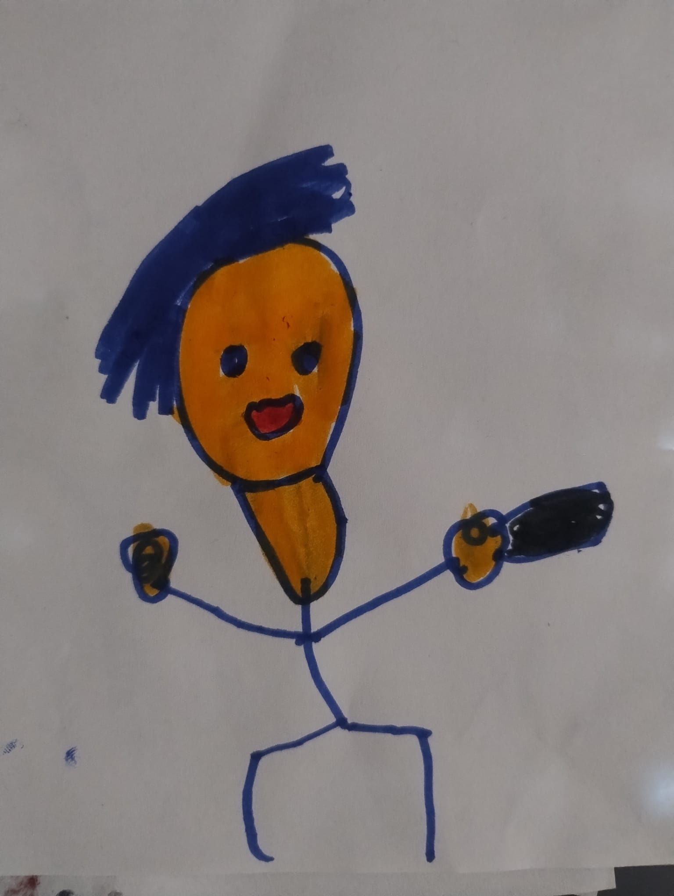
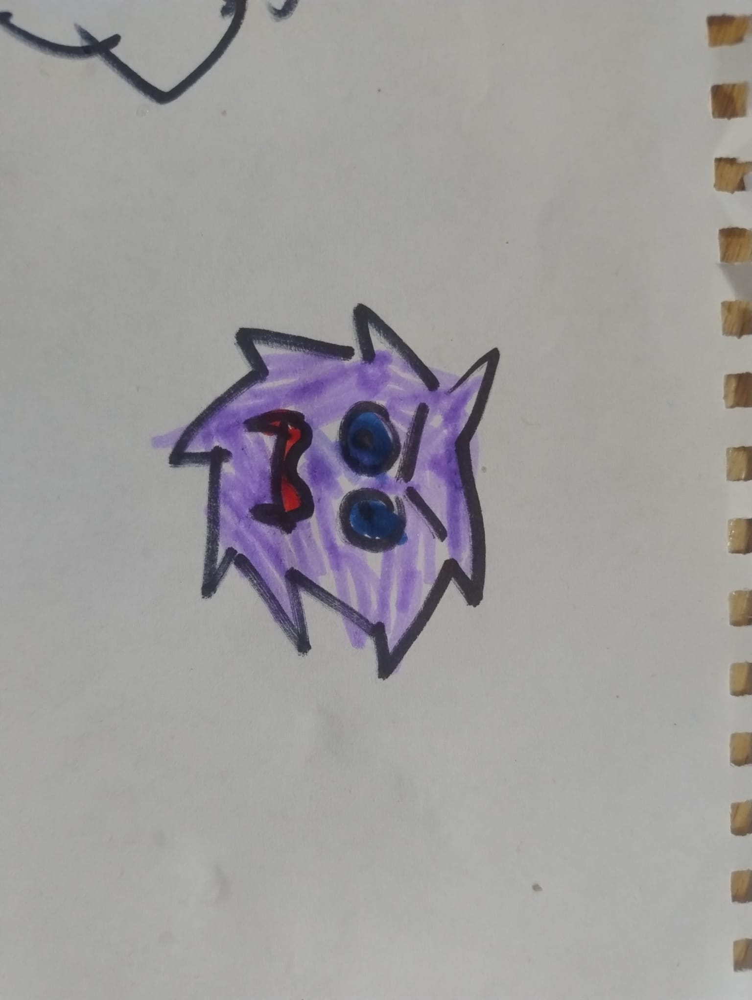
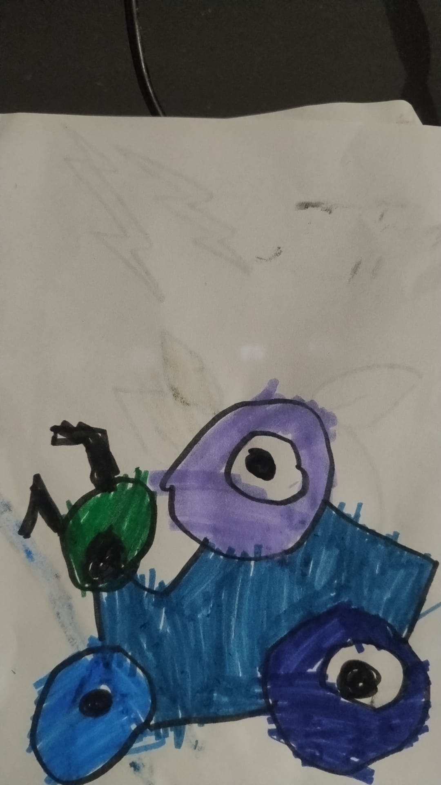
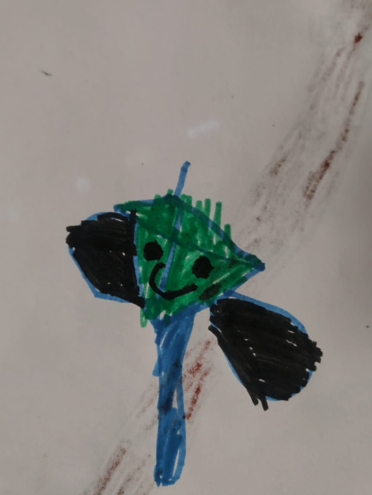
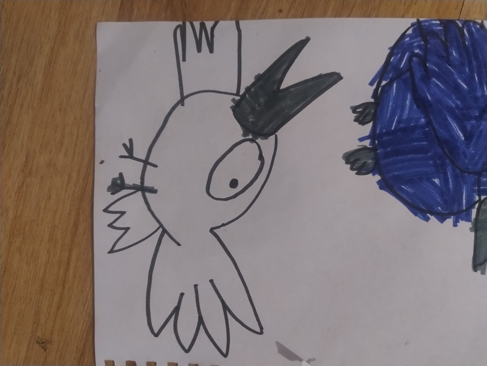
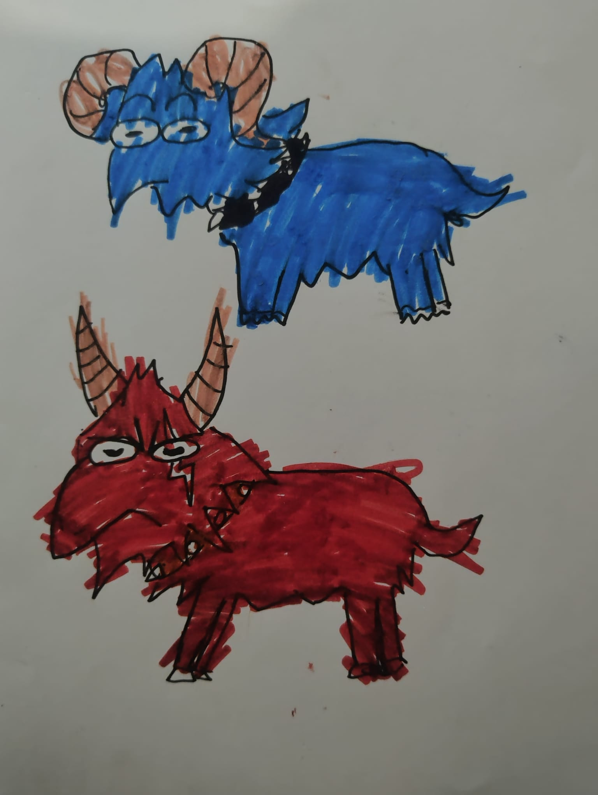

# Thor Endless Runner

**Play it on itch.io:** [rustyroboz.itch.io/thor-runner](https://rustyroboz.itch.io/thor-runner)

---

## Description

**Thor Endless Runner** is a browser-based endless runner action game. Take control of Thor, the God of Thunder, as he charges relentlessly through a mythological world, jumping over obstacles and smashing enemies with his legendary hammer.

---

## The Story Behind the Game

This game was born from a family project with my five-year-old twin children. It all started with a simple question: *"What kind of game would you like to make?"*

They are deeply fascinated by Nordic mythology, largely thanks to the Spanish YouTube channel **[Destripando la Historia](https://www.youtube.com/@DestripandolaHistoria)** by Pascu and Rodri, which tells mythology stories in a fun and irreverent way. So the answer was immediate: **Thor and Loki**.

### How it was made

- **Characters & Art**: The main characters — Thor and Loki — are based on the iconic drawings from *Destripando la Historia*. I made the initial sketches, and my children colored them. The enemies were created from scratch by the kids themselves, unleashing their inner monster designers. Apollo and Artemis also made it into the game: Artemis was drawn from scratch, and Apollo was colored by them.

- **Music**: The soundtrack was generated using **[Suno AI](https://suno.com)**, producing an epic Norse-flavored theme for our thunder god.

- **Intro Video**: The cinematic intro was created using **Veo3**, Google's AI video generation tool.

- **The Code**: The game itself was programmed using **VS Code** with **GitHub Copilot** and **Claude Code**. Nearly everything was voice-coded — commands were dictated to the AI using **[Wispr Flow](https://wisprflow.ai/r?DAVID38580)**, a voice-to-text tool that makes talking to LLMs feel natural and fast. Try it with my referral link and get a **free month of Pro**: [wisprflow.ai/r?DAVID38580](https://wisprflow.ai/r?DAVID38580)

The result is a fully playable browser game built through the combined creativity of a dad, two five-year-olds, and a handful of AI tools — proof that you don't need a big studio to make something fun.

---

## Controls
- **Space / Touch**: Jump
- **Z / Click**: Attack

## Features
- Endless runner with increasing speed
- Day/Night cycle
- Boss encounter with Loki
- AI-generated music and intro cinematic
- Mobile friendly

---

## Original Drawings

These are the hand-drawn sketches and colorings made by the kids that were used as the basis for the game's artwork.

| | | |
|:---:|:---:|:---:|
|  |  |  |
| Thor & Loki sketch | Loki | Artemisa |
|  |  |  |
| Enemy 1 | Enemy 2 | Enemy 3 |
|  |  |  |
| Blue Bird | White Bird | Loki's Goats |

---
*Built with love, crayons, and AI.*
